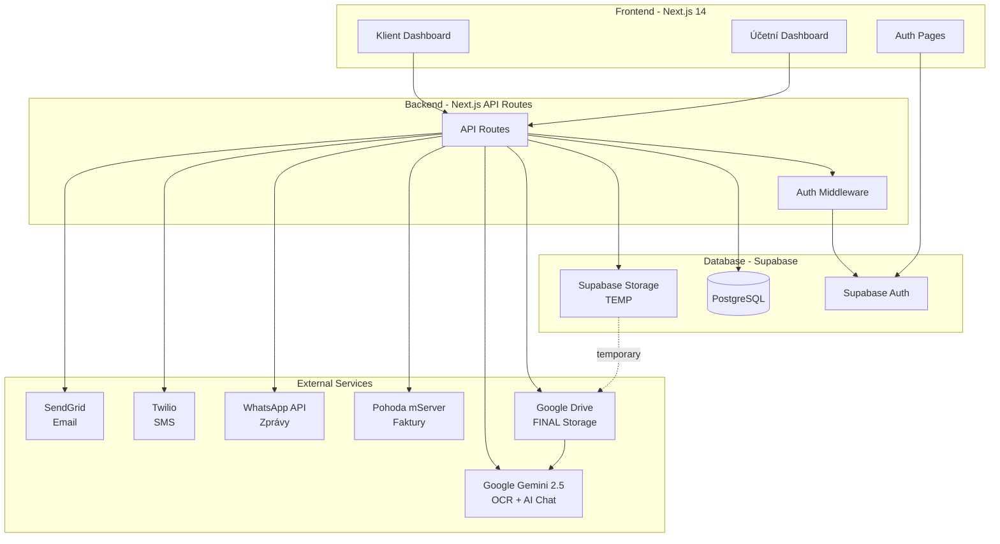
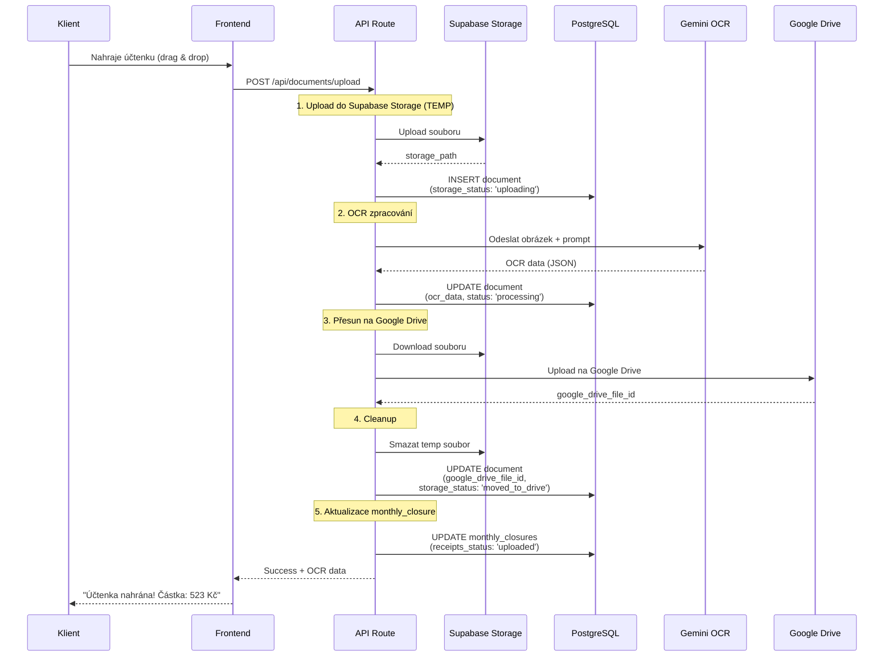
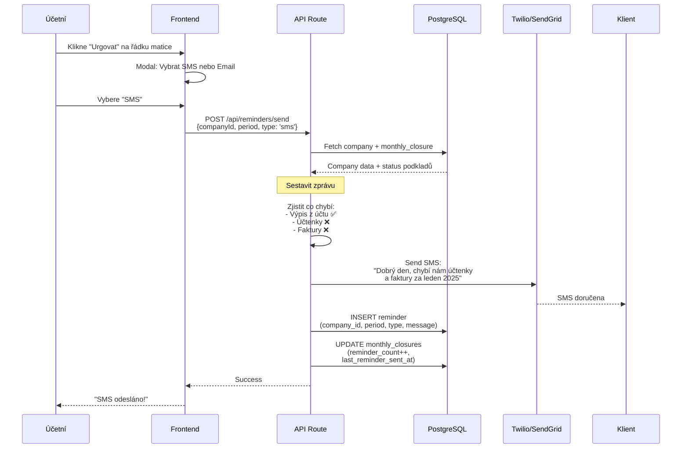
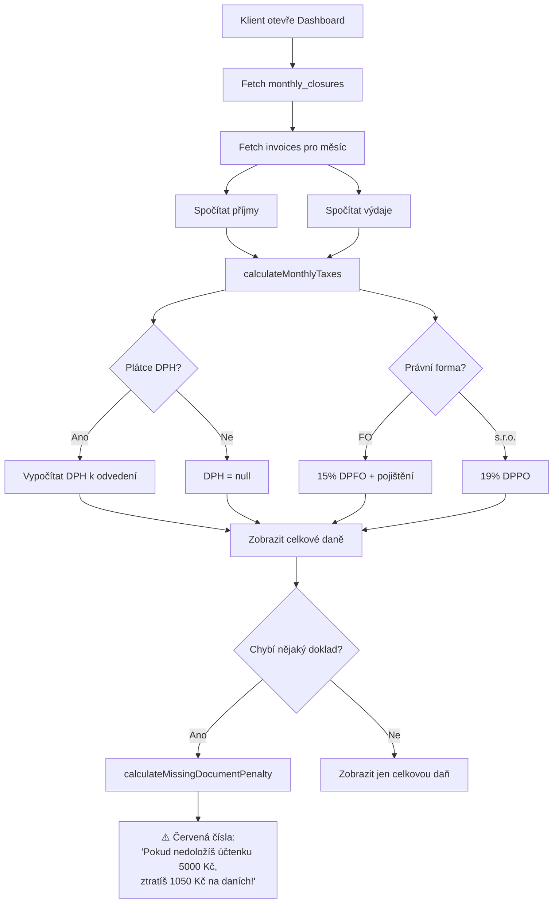
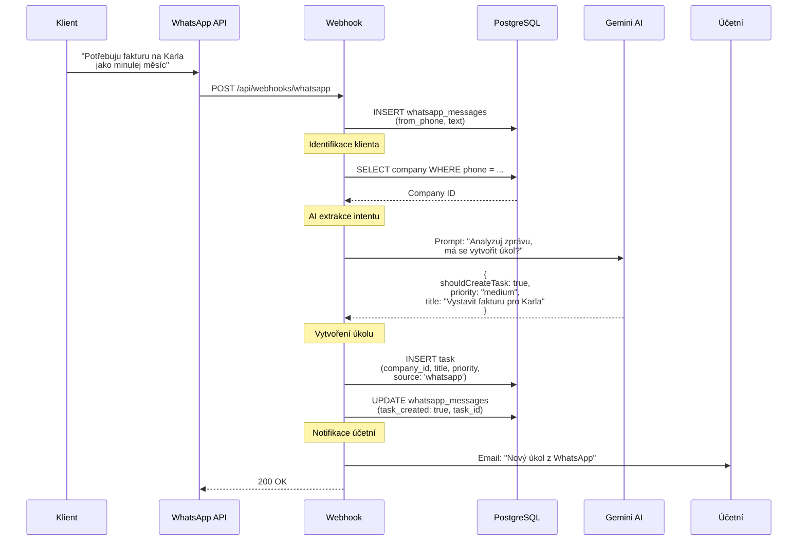

# 🏗️ ARCHITEKTURA PROJEKTU - Účetní OS

**Kompletní technický přehled systému, integrace a datových toků**

---

## 📋 OBSAH

1. [Přehled systému](#přehled-systému)
2. [Architektura komponent](#architektura-komponent)
3. [Externí integrace](#externí-integrace)
4. [Data Flow diagramy](#data-flow-diagramy)
5. [Feature list s prioritami](#feature-list-s-prioritami)
6. [API endpoints](#api-endpoints)

---

## 🎯 PŘEHLED SYSTÉMU

### High-Level Architektura



---

## 🧩 ARCHITEKTURA KOMPONENT

### Vrstvová architektura

```
┌─────────────────────────────────────────────┐
│  PRESENTATION LAYER (Next.js Pages)         │
│  - Klientský dashboard                      │
│  - Účetní dashboard (Master matice!)        │
│  - Auth pages (Login/Register)              │
└─────────────────────────────────────────────┘
                    ↕
┌─────────────────────────────────────────────┐
│  API LAYER (Next.js API Routes)             │
│  - /api/documents/upload                    │
│  - /api/ocr/process                         │
│  - /api/companies/[id]/closures             │
│  - /api/reminders/send                      │
│  - /api/invoices/generate                   │
│  - /api/webhooks/whatsapp                   │
└─────────────────────────────────────────────┘
                    ↕
┌─────────────────────────────────────────────┐
│  BUSINESS LOGIC LAYER (lib/)                │
│  - google-drive.ts (Service Account)        │
│  - ocr.ts (Gemini integration)              │
│  - tax-calculator.ts (Daňové výpočty)       │
│  - pohoda-xml.ts (XML generator)            │
│  - supabase.ts (DB client)                  │
└─────────────────────────────────────────────┘
                    ↕
┌─────────────────────────────────────────────┐
│  DATA LAYER                                 │
│  - Supabase PostgreSQL (metadata)           │
│  - Supabase Storage (temp files)            │
│  - Google Drive (final files)               │
└─────────────────────────────────────────────┘
```

---

## 🔌 EXTERNÍ INTEGRACE

### 1. **Supabase** (Database + Auth + Storage)

**Účel:** Hlavní backend-as-a-service

**Co poskytuje:**
- PostgreSQL databáze
- Authentication (Email/Password + Google OAuth)
- Row Level Security (RLS)
- Storage bucket (dočasné soubory)
- Real-time subscriptions

**Jak se napojuje:**
```typescript
// lib/supabase.ts
import { createClient } from '@supabase/supabase-js'

export const supabase = createClient(
  process.env.NEXT_PUBLIC_SUPABASE_URL!,
  process.env.NEXT_PUBLIC_SUPABASE_ANON_KEY!
)
```

**API Endpoints používající Supabase:**
- ✅ Všechny CRUD operace (users, companies, documents, invoices, tasks)
- ✅ Auth middleware
- ✅ File upload (temp)

---

### 2. **Google Drive** (Final Storage)

**Účel:** Dlouhodobé uložení všech dokladů

**Co poskytuje:**
- Neomezené úložiště (Google Workspace)
- Přímý přístup pro účetní (nativní Drive UI)
- Integrace s Gemini AI (chat s dokumenty)

**Struktura složek:**
```
📁 Účetní OS/
  📁 Klient_ABC_sro_12345678/
    📁 2025/
      📁 01_Leden/
        📄 vypis_uctu_2025_01_15.pdf
        🧾 uctenka_lidl_2025_01_20.jpg
        📑 faktura_F001_2025_01.pdf
      📁 02_Unor/
        ...
```

**Jak se napojuje:**
```typescript
// lib/google-drive.ts
import { google } from 'googleapis'

const auth = new google.auth.GoogleAuth({
  credentials: {
    client_email: process.env.GOOGLE_SERVICE_ACCOUNT_EMAIL,
    private_key: process.env.GOOGLE_SERVICE_ACCOUNT_PRIVATE_KEY,
  },
  scopes: ['https://www.googleapis.com/auth/drive.file'],
})

const drive = google.drive({ version: 'v3', auth })
```

**API Endpoints:**
- ✅ `/api/google-drive/upload` - Přesun z Supabase → Drive
- ✅ `/api/google-drive/download` - Stažení pro zobrazení
- ✅ `/api/google-drive/list` - Seznam souborů klienta

---

### 3. **Google Gemini 2.5 Flash** (OCR + AI)

**Účel:** Zpracování dokumentů a AI asistent

**Co poskytuje:**
- OCR (optické čtení účtenek)
- Extrakce strukturovaných dat (částka, dodavatel, datum)
- AI chat s kontextem (přístup k Drive souborům)
- Extrakce intentu z WhatsApp zpráv

**Jak se napojuje:**
```typescript
// lib/ocr.ts
import { GoogleGenerativeAI } from '@google/generative-ai'

const genAI = new GoogleGenerativeAI(process.env.GEMINI_API_KEY!)
const model = genAI.getGenerativeModel({ model: 'gemini-2.5-flash' })
```

**Use Cases:**
1. **OCR účtenek:**
   ```typescript
   Input: Fotka účtenky (base64)
   Output: {
     date: "2025-01-20",
     total_amount: 523.50,
     supplier_name: "Lidl",
     supplier_ico: "12345678",
     items: [...],
     confidence: 0.95
   }
   ```

2. **AI Chat:**
   ```typescript
   Prompt: "Vysvětli transakci na řádku 15 v @vypis_uctu_2025_01.pdf"
   Context: Přístup k Google Drive file_id
   Output: Analýza + odpověď
   ```

3. **WhatsApp Intent:**
   ```typescript
   Input: "Potřebuju fakturu na Karla jako minulej měsíc"
   Output: {
     shouldCreateTask: true,
     priority: "medium",
     title: "Vystavit fakturu pro Karla"
   }
   ```

**API Endpoints:**
- ✅ `/api/ocr/process` - OCR zpracování
- ✅ `/api/ai-chat` - Chat asistent
- ✅ `/api/webhooks/whatsapp` (používá Gemini pro intent)

---

### 4. **Pohoda mServer** (Účetní systém)

**Účel:** Integrace s účetním softwarem

**Co poskytuje:**
- Import/export faktur (XML)
- Seznam klientů
- Standardní položky faktur

**Jak se napojuje:**
```typescript
// lib/pohoda-xml.ts
export function generateInvoiceXML(invoice: Invoice): string {
  return `<?xml version="1.0" encoding="UTF-8"?>
  <dat:dataPack ...>
    <inv:invoice>
      ...
    </inv:invoice>
  </dat:dataPack>`
}
```

**API Endpoints:**
- ✅ `/api/pohoda/export` - Export faktury do Pohody
- ✅ `/api/pohoda/import` - Import klientů/položek z Pohody

---

### 5. **WhatsApp Business API** (Komunikace)

**Účel:** Automatizace komunikace s klienty

**Jak funguje:**
```
Klient pošle WhatsApp zprávu
  ↓
Webhook → /api/webhooks/whatsapp
  ↓
Uložit do DB (whatsapp_messages)
  ↓
Identifikovat klienta (phone_number → company)
  ↓
Gemini: Extrahovat intent
  ↓
Vytvořit úkol (tasks)
  ↓
Notifikovat účetní (email)
```

**API Endpoints:**
- ✅ `/api/webhooks/whatsapp` - Příjem zpráv

---

### 6. **Twilio** (SMS)

**Účel:** Urgování klientů přes SMS

**Use Case:**
```
Účetní klikne "Urgovat" v Master Matici
  ↓
/api/reminders/send?type=sms
  ↓
Twilio odešle SMS: "Dobrý den, chybí nám od vás výpis z účtu za leden 2025..."
```

**API Endpoints:**
- ✅ `/api/reminders/send` (type: sms)

---

### 7. **SendGrid** (Email)

**Účel:** Urgování klientů přes email

**Use Case:**
```
Účetní klikne "Urgovat" v Master Matici
  ↓
/api/reminders/send?type=email
  ↓
SendGrid odešle email s detaily co chybí
```

**API Endpoints:**
- ✅ `/api/reminders/send` (type: email)

---

## 📊 DATA FLOW DIAGRAMY

### 1. Upload dokladu (2-stupňový proces)



---

### 2. Master Matice (Účetní Dashboard)

```mermaid
flowchart TD
    A[Účetní otevře dashboard] --> B[Fetch všechny companies]
    B --> C[Fetch monthly_closures pro všechny firmy]
    C --> D{Pro každou firmu}

    D --> E[Zobraz řádek v matrici]
    E --> F{Pro každý měsíc 2025}

    F --> G{Status podkladů?}
    G -->|Chybí| H[🔴 Červená buňka]
    G -->|Nahráno| I[🟡 Žlutá buňka]
    G -->|Schváleno| J[🟢 Zelená buňka]

    H --> K[Tlačítko Urgovat]
    I --> L[Klik → Detail měsíce]
    J --> L

    K --> M[Modal: SMS nebo Email?]
    M --> N[/api/reminders/send]
    N --> O[Twilio/SendGrid]
    O --> P[Update monthly_closures<br/>reminder_count++]
```

---

### 3. Urgování (SMS/Email)



---

### 4. Daňová kalkulačka (Červená čísla)



---

### 5. WhatsApp → Úkoly (Automatizace)



---

## 📋 FEATURE LIST S PRIORITAMI

### P0 - MUST HAVE (dělat TEĎKA)

| # | Feature | Popis | Integrace | Status |
|---|---------|-------|-----------|--------|
| 1 | **Master Matice** | Tabulka všech klientů × 12 měsíců<br/>Barvy: 🔴 chybí, 🟡 nahráno, 🟢 schváleno | Supabase PostgreSQL | ❌ TODO |
| 2 | **Upload dokladů** | Drag & drop → Supabase Storage → OCR → Google Drive | Supabase Storage, Gemini, Google Drive | ❌ TODO |
| 3 | **OCR zpracování** | Gemini přečte účtenku, extrahuje částku/dodavatele | Google Gemini 2.5 Flash | ❌ TODO |
| 4 | **Daňová kalkulačka** | Real-time odhad DPH + DPFO/DPPO | lib/tax-calculator.ts (hotovo!) | ✅ HOTOVO |
| 5 | **Červená čísla** | "Pokud nedoložíš, ztratíš X Kč na daních" | lib/tax-calculator.ts | ✅ HOTOVO (logika) |
| 6 | **Autentizace** | Login/Register, role-based routing | Supabase Auth | ❌ TODO |
| 7 | **Měsíční checklist** | Klient vidí co mu chybí za daný měsíc | Supabase PostgreSQL | ❌ TODO |

---

### P1 - HIGH PRIORITY (dělat BRZO)

| # | Feature | Popis | Integrace | Status |
|---|---------|-------|-----------|--------|
| 8 | **Urgovací systém** | SMS/Email když chybí podklady | Twilio, SendGrid | ❌ TODO |
| 9 | **Pohoda export** | Export faktury do Pohoda XML | Pohoda mServer | ❌ TODO |
| 10 | **Pohoda import** | Import klientů/položek z Pohody | Pohoda mServer | ❌ TODO |
| 11 | **Fakturace UI** | Formulář pro vystavování faktur | Pohoda mServer | ❌ TODO |
| 12 | **Párování plateb** | Výpisy × faktury (AI matching) | Google Gemini | ❌ TODO |

---

### P2 - MEDIUM PRIORITY (pak)

| # | Feature | Popis | Integrace | Status |
|---|---------|-------|-----------|--------|
| 13 | **WhatsApp webhook** | Příjem zpráv → vytvoření úkolu | WhatsApp Business API | ❌ TODO |
| 14 | **AI extrakce intentu** | Gemini analyzuje WhatsApp zprávu | Google Gemini | ❌ TODO |
| 15 | **AI chat asistent** | Chat s kontextem (přístup k Drive) | Google Gemini + Google Drive | ❌ TODO |
| 16 | **Úkolový systém** | Tabulka úkolů pro účetní | Supabase PostgreSQL | ❌ TODO |
| 17 | **Chat ke každému úkolu** | Diskuse mezi klientem a účetní | Supabase Real-time | ❌ TODO |

---

### P3 - LOW PRIORITY (možná)

| # | Feature | Popis | Integrace | Status |
|---|---------|-------|-----------|--------|
| 18 | **Advanced reporting** | Grafy, statistiky, projekce | Recharts | ❌ TODO |
| 19 | **Multi-firma support** | Jeden klient má více firem | Supabase PostgreSQL | ❌ TODO |
| 20 | **Mobile app** | React Native / PWA | - | ❌ TODO |
| 21 | **Push notifikace** | Web Push API | - | ❌ TODO |

---

## 🛣️ API ENDPOINTS

### Auth

```typescript
POST   /api/auth/login           // Přihlášení
POST   /api/auth/register        // Registrace
POST   /api/auth/logout          // Odhlášení
GET    /api/auth/session         // Aktuální uživatel
```

### Documents (Doklady)

```typescript
POST   /api/documents/upload                    // Upload → Supabase → OCR → Drive
GET    /api/documents?companyId&period         // Seznam dokladů
GET    /api/documents/[id]                     // Detail dokladu
DELETE /api/documents/[id]                     // Smazat doklad
PATCH  /api/documents/[id]                     // Schválit/Zamítnout
```

### Companies (Firmy)

```typescript
GET    /api/companies                          // Seznam všech firem (účetní)
GET    /api/companies/[id]                     // Detail firmy
GET    /api/companies/[id]/closures            // Monthly closures (matice data)
POST   /api/companies                          // Vytvořit firmu
PATCH  /api/companies/[id]                     // Upravit firmu
```

### Monthly Closures (Uzávěrky)

```typescript
GET    /api/closures?companyId&period          // Uzávěrka za měsíc
PATCH  /api/closures/[id]                      // Aktualizovat status
POST   /api/closures/[id]/approve              // Schválit uzávěrku
```

### OCR

```typescript
POST   /api/ocr/process                        // Zpracovat doklad přes Gemini
```

### Reminders (Urgence)

```typescript
POST   /api/reminders/send                     // Odeslat SMS/Email urgenci
GET    /api/reminders?companyId                // Historie urgencí
```

### Invoices (Faktury)

```typescript
GET    /api/invoices?companyId&period          // Seznam faktur
POST   /api/invoices                           // Vytvořit fakturu
GET    /api/invoices/[id]                      // Detail faktury
```

### Pohoda

```typescript
POST   /api/pohoda/export                      // Export faktury do Pohody (XML)
GET    /api/pohoda/clients                     // Import klientů z Pohody
GET    /api/pohoda/items                       // Import položek z Pohody
```

### WhatsApp

```typescript
POST   /api/webhooks/whatsapp                  // Webhook pro příchozí zprávy
```

### Tasks (Úkoly)

```typescript
GET    /api/tasks                              // Seznam úkolů
POST   /api/tasks                              // Vytvořit úkol
PATCH  /api/tasks/[id]                         // Aktualizovat úkol
```

### AI Chat

```typescript
POST   /api/ai-chat                            // Chat s AI asistentem
```

---

## 🔐 BEZPEČNOST

### Row Level Security (RLS) Policies

```sql
-- Klient vidí jen svoje data
CREATE POLICY "Clients can view own company"
ON companies FOR SELECT
USING (owner_id = auth.uid());

-- Účetní vidí vše
CREATE POLICY "Accountants can view all"
ON companies FOR SELECT
USING (
  EXISTS (
    SELECT 1 FROM users
    WHERE id = auth.uid()
    AND role IN ('accountant', 'admin')
  )
);

-- Klient může nahrát jen svoje doklady
CREATE POLICY "Clients can upload own documents"
ON documents FOR INSERT
WITH CHECK (
  company_id IN (
    SELECT id FROM companies WHERE owner_id = auth.uid()
  )
);
```

---

## 📦 DEPLOYMENT

### Vercel (Hosting)

```bash
# 1. Connect GitHub repo
# 2. Import project
# 3. Add environment variables
# 4. Deploy
```

### Environment Variables (Production)

```bash
NEXT_PUBLIC_SUPABASE_URL=...
NEXT_PUBLIC_SUPABASE_ANON_KEY=...
SUPABASE_SERVICE_ROLE_KEY=...

GOOGLE_SERVICE_ACCOUNT_EMAIL=...
GOOGLE_SERVICE_ACCOUNT_PRIVATE_KEY=...
GOOGLE_DRIVE_PARENT_FOLDER_ID=...

GEMINI_API_KEY=...

POHODA_MSERVER_URL=...
POHODA_USERNAME=...
POHODA_PASSWORD=...

TWILIO_ACCOUNT_SID=...
TWILIO_AUTH_TOKEN=...
TWILIO_PHONE_NUMBER=...

SENDGRID_API_KEY=...
SENDGRID_FROM_EMAIL=...

WHATSAPP_BUSINESS_ID=...
WHATSAPP_ACCESS_TOKEN=...
WHATSAPP_PHONE_NUMBER_ID=...
WHATSAPP_VERIFY_TOKEN=...
```

---

## 📈 MONITORING & OBSERVABILITY

### Co sledovat:

1. **Upload success rate** - % úspěšných uploadů
2. **OCR accuracy** - Průměrná confidence Gemini
3. **API response times** - Latence jednotlivých endpointů
4. **Storage usage** - Supabase Storage (mělo by být ~0 po přesunu na Drive)
5. **Urgování effectiveness** - % klientů co dodali podklady po urgenci
6. **Monthly closure completion rate** - % uzavřených měsíců

### Nástroje:

- **Vercel Analytics** (zdarma s projektem)
- **Supabase Dashboard** (monitoring DB + Auth)
- **Sentry** (error tracking) - optional

---

**Last updated:** 2025-01-24

